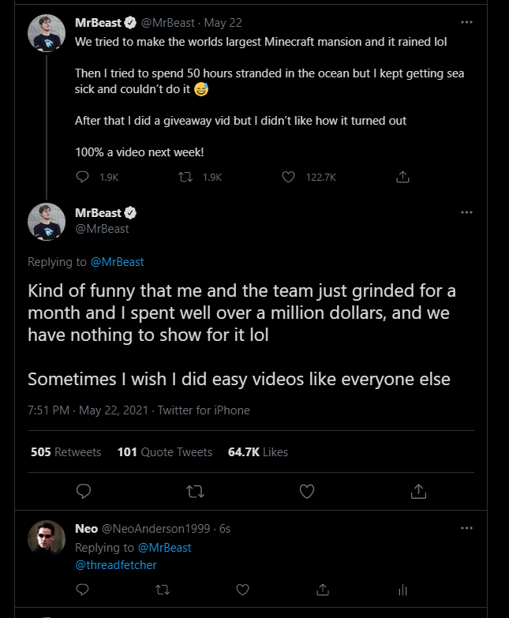

# How to save thread

1. Follow [@threadfetcher](https://twitter.com/threadfetcher) on Twitter so that we can dm you 
2. Make sure it's a Twitter thread, not a solo tweet or a reply to a tweet before you mention  us

3. Reply from any of the tweets from the thread mentioning our name[ @threadfetcher](https://twitter.com/threadfetcher) 

